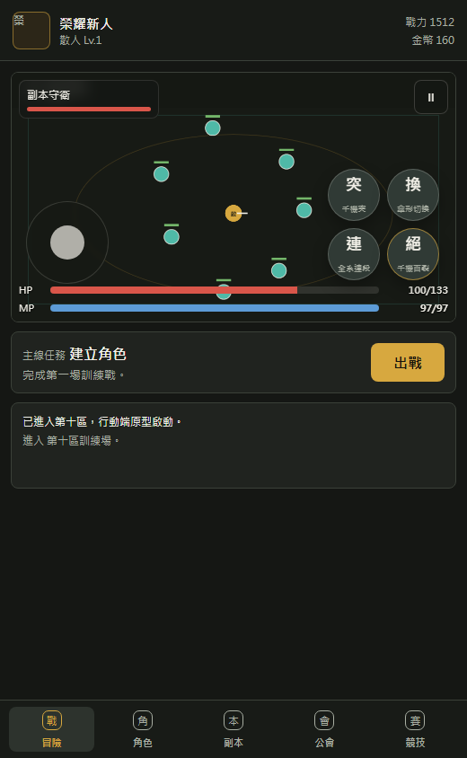
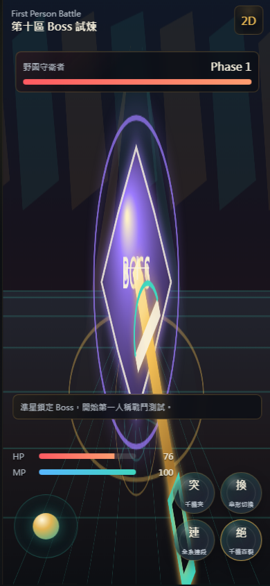
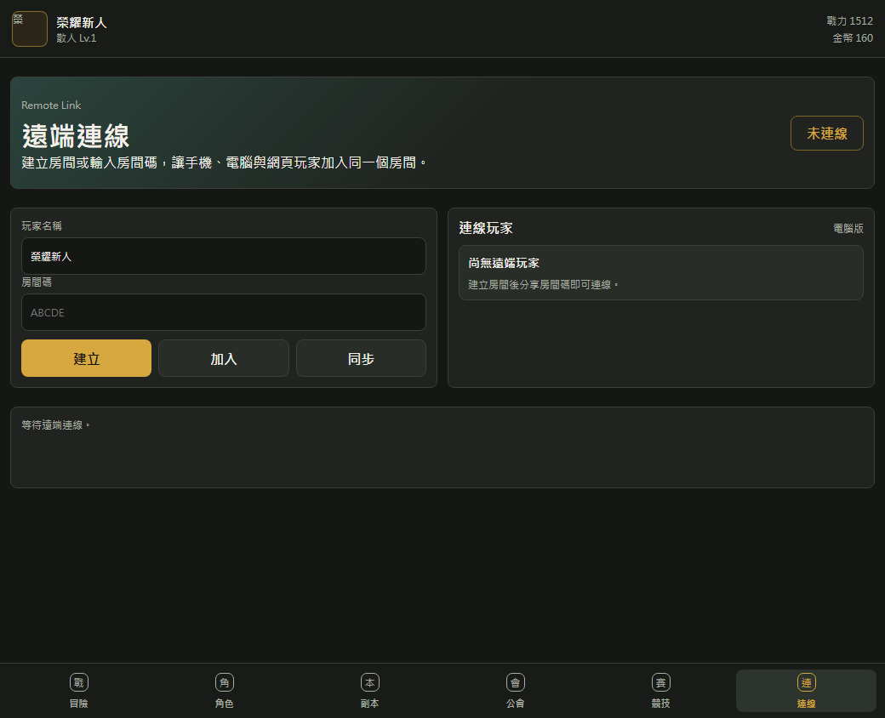

# 榮耀行動原型

Status: Dynamic MVP Prototype / Mobile/Desktop/Web Remote Multiplayer Link

[Live Demo](https://the-kings-avatar-glory-mobile-game.netlify.app)

[Vercel Demo](https://the-kings-avatar-glory-mobile-game.vercel.app)

這是一個可直接在瀏覽器執行的手機遊戲垂直切片，先把 MMORPG 手遊最核心的玩法跑起來：即時戰鬥、職業切換、技能冷卻、Boss、副本、裝備、公會、競技聯賽與本機存檔。

> 商業化若要使用《全職高手》名稱、角色、隊伍、美術或小說設定，需要取得權利方授權。本專案目前使用原創視覺與可替換資料，適合作為玩法原型。

## Screenshots

### Mobile Battle



### First Person Combat



### Remote Link



## Play Locally

```powershell
node local-server.js
```

Open:

```text
http://127.0.0.1:5173
```

如果 `5173` 已被占用，伺服器會自動嘗試下一個 port，請以終端輸出的網址為準。

也可以直接開啟 `index.html`，但 PWA 快取需要透過本機伺服器才會啟用。

## Dynamic Web Features

本專案已從純靜態頁升級為 Netlify Functions 動態網站：

- `/api/game-state`: 即時回傳伺服器時間、輪值活動、賽季名稱與排行榜
- `/api/remote-room`: 建立房間、加入房間、同步遠端玩家狀態
- 首頁 Live Ops 區塊會從 API 讀取活動資料
- 競技排行榜會使用 API 回傳的即時資料
- 遠端連線頁可用房間碼支援手機版、電腦版、網頁版玩家同步
- Vercel 版本提供同名 `/api/*` 動態路由，可直接部署為 Vercel Functions
- 玩家可領取當前活動獎勵，領取狀態存在 localStorage

## Prototype Pages

- `index.html`: 手機直式 2D Canvas 戰鬥 MVP
- `first-person.html`: 第一人稱戰鬥視角原型

## Features

- 手機直式介面與虛擬搖桿
- 25 種職業入口：24 職業加散人原型
- 依職系切換的 4 技能組與技能升級
- Canvas 即時戰鬥、敵人 AI、Boss 二階段、投射物與傷害數字
- 副本、野圖 Boss、職業聯賽試煉
- 裝備掉落、打造、裝備欄與戰力計算
- 公會科技、AI 隊友派遣、公會副本入口
- 1v1、3v3、5v5 本地競技模擬
- localStorage 自動存檔
- 第一人稱戰鬥原型：準星、Boss 血條、第一人稱武器、技能鍵、畫面震動
- Netlify Functions 動態 API：Live Ops、輪值活動與排行榜
- 遠端連線房間：跨手機、電腦、網頁同步房間碼與玩家列表

## First Person Battle Direction

下一版會把目前 2D 戰鬥逐步升級為手機第一人稱戰鬥體驗：

- 中央準星與第一人稱武器視角
- 手機觸控轉向與左手虛擬搖桿移動
- 右手普攻、職業技能與絕招鍵
- 上方 Boss 鎖定血條、傷害數字與技能冷卻
- 可替換職業武器外觀，例如戰矛、法杖、雙槍、千機傘
- WebXR / VR 模式前置架構

## Roadmap

- [x] 手機直式 2D 戰鬥 MVP
- [x] README 截圖區塊與公開 repo 結構整理
- [x] 第一人稱戰鬥 HTML prototype
- [x] Netlify Functions 動態 API
- [x] 手機 / 電腦 / 網頁遠端連線房間
- [ ] 手機拖曳轉向與觸控視角旋轉
- [ ] 角色模型 / 武器模型
- [ ] Boss 技能範圍提示與更多攻擊模式
- [ ] 截圖 GIF 與 GitHub Pages / Netlify Demo
- [ ] WebXR / VR 模式

## Project Structure

```text
assets/
docs/
  design/
  screenshots/
src/
netlify/
  functions/
index.html
first-person.html
styles.css
first-person.css
local-server.js
README.md
```

## Development Notes

這個原型刻意保持無外部依賴，方便快速部署到 GitHub Pages、Netlify 或任何靜態網站服務。下一階段若要進入正式 3D，可以把戰鬥資料與職業資料抽成 JSON，再移植到 Three.js、Godot、Unity 或 Unreal。
